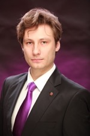

# Constantin Novoslugin (Константин Новослугин)

Всю жизнь я так или иначе связан со сферой ИТ. 
Учился в физ-мат классе в школе, посещал кружок радиоэлектроники писал первые программы на Бэйсике и Паскале. 
После на радиотехническом факультете университета писал программы на Си и Ассемблере для микроконтроллеров. 
Параллельно подрабатывал написанием программ на Си и Делфи, а также создавая сайты.
После окончания учёбы, продолжая писать программы, занимался системным администрированием серверов на различных ОС, настройкой сетевого оборудования.
Позже изучил промышленное оборудование, программирование ПЛК и написание УП для станков.
В настоящее время для заказчика пишу код на ПХП и Питон, иногда C#, изучаю мобильную разработку.

## Навыки:
* умение разбираться в чужом коде, быстрая обучаемость
* знание некоторых языков программирования: asm, c, c++, c#, delphi, php, python
* умение работать в команде, коммуникабельность

